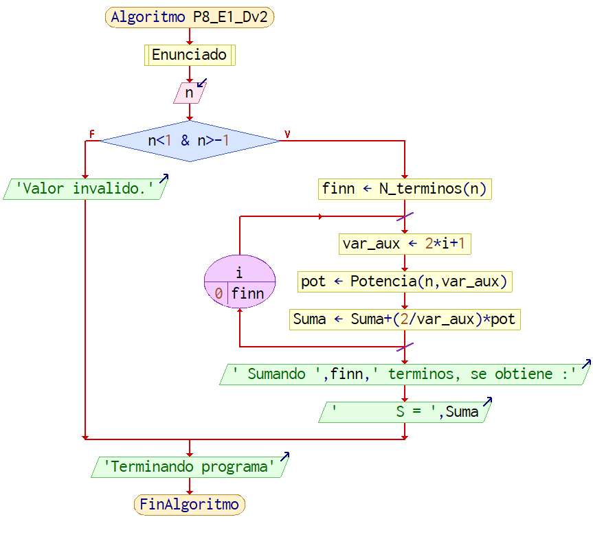
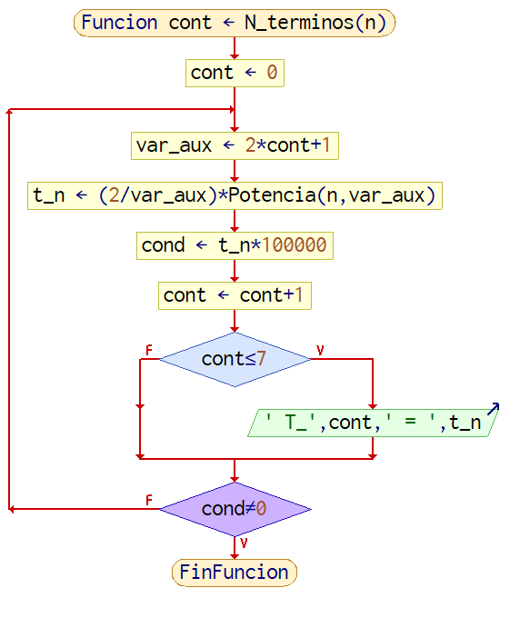
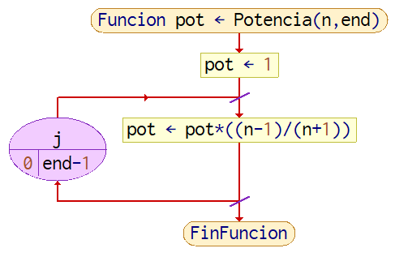
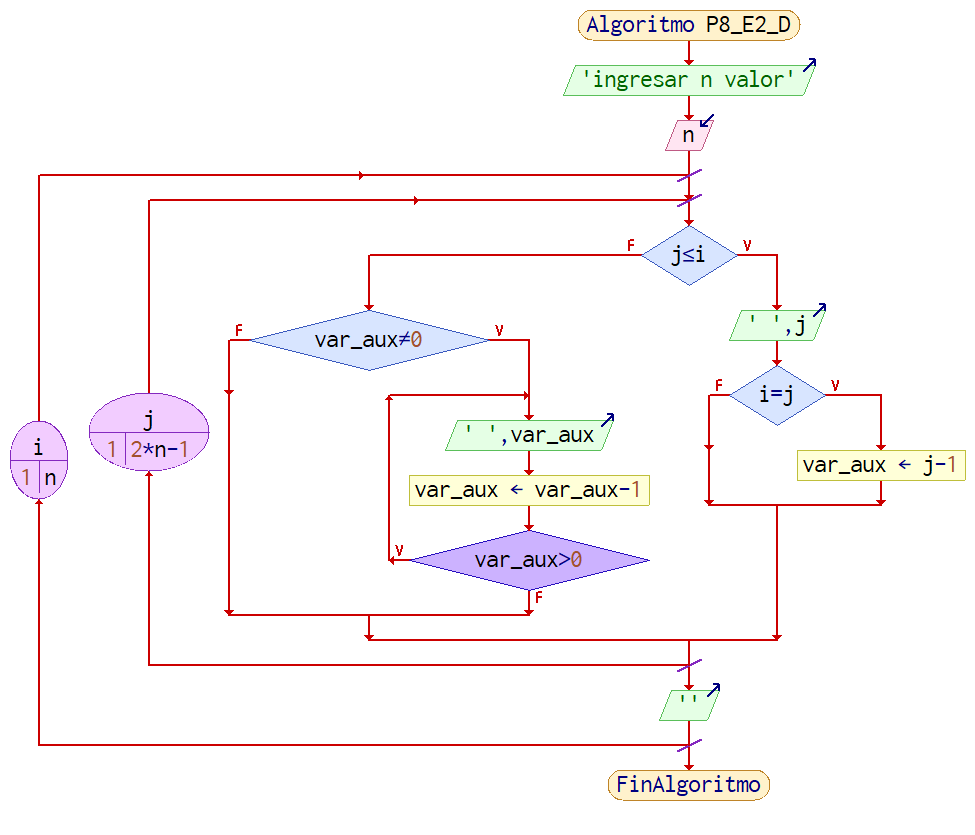
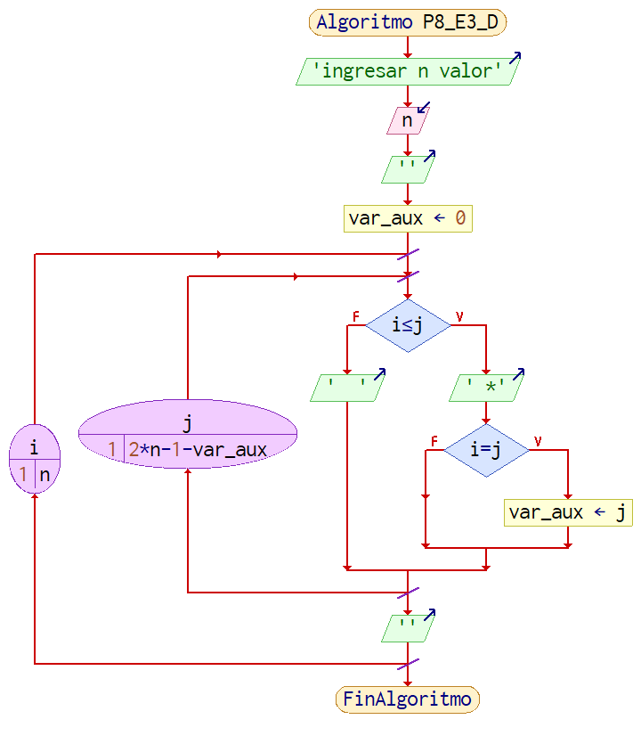

># Practica # 8

<h2 align="center"> INSTRUCCIONES REPETITIVAS </h2> <br>

---

<h3 align="center"> Tabla del contenido </h3> <br> 

<h3> Ejercicio 1 </h3> <br>

>- [Enunciado](#enunciado_1)
>	- [Diagrama de flujo](#diagrama_de_flujo_1)
>	- [Codificacion en C](#codificacion_en_C_1)
>		- [Ejecucion](#ejecucion_1)


<h3> Ejercicio 2 </h3> <br>

>- [Enunciado](#enunciado_2)
>	- [Diagrama de flujo](#diagrama_de_flujo_2)
>	- [Codificacion en C](#codificacion_en_C_2)
>		- [Ejecucion](#ejecucion_2)

<h3> Ejercicio 3 </h3> <br>

>- [Enunciado](#enunciado_3)
>	- [Diagrama de flujo](#diagrama_de_flujo_3)
>	- [Codificacion en C](#codificacion_en_C_3)
>		- [Ejecucion](#ejecucion_3)

---
<h2 align="center"> EJERCICIO 1 </h2> <br>


### Enunciado_1

1. Realizar un programa para calcular el logaritmo natural de un numero $x>0$ ingresando por teclado, segun la serie

$$\mbox{ln}(x) = 2·\sum_{i=0}^{\infty}\dfrac{1}{2i+1}·\bigg(\dfrac{\mbox{x}-1}{\mbox{x}+1}\bigg)^{2i+1}$$

El resultado debe ser con 5 decimales de precision.Debe mostrar el diagrama de flujo en PSeInt, el código realizado en Dev-C++
y una captura de la ejecución del programa.

---

<h3 align="center"> Resolviendo </h3> <br>


#### Diagrama_de_flujo_1

>${\color{TealBlue}\mbox{Flujograma  (Programa principal)}}$
>- Inicia con un determinado enunciado, el cual aclarara las condiciones de uso del programa, tambien se le pide al usuario que ingrese 1 valor para que el programa funcione.
>- La condicional if{}else{}, si fuera el caso de operar la tarea de "else" entonces el programa mostrata un texto aclarando que se ingresaron datos erroneos y terminara el programa.
>- La condicional if{}else{}, cuando el usuario ingresa valores validos el programa realizara las tareas necesarias para resolver el problema planteado.

  

<p align="center">
  
</p>

> ${\color{TealBlue}\mbox{Flujograma  (N terminos)}}$
> - Al principio se inicializa la variable de tipo entera "cont", que dentro de esta se guardara la cantidad de terminos necesarios (a sumar) para obtener el valor deseado.
> - Se inicia un ciclo do{}while(); , para repetir la cantidad de veces necesaria para que el termino enesimo tienda al valor de 0.
> - A la variable "var_aux" se le asigna la tarea de calcular "2*cont+1".
> - En varialble "t_n" se le guarda el valor del termino n-simo calculado.
> - A la variable "cond" se le asigna el valor de la varaible n-sima ***multiplicado este por 100000*** para los 5 decimales de precision.
> - El contador "cont" incrementa en 1 para la siguiente repeticion.
> - Se inicia una condicional if() para mostrar los terminos calculados, solo los terminos del 1 a 7, para no saturar lo mostrado en pantalla.
> - Cierra el ciclo do{}while(), con la condicional para que solo se termine el ciclo si y solo si el valor del termino n-simo es igual a 0.


<p align="center">
  
</p>


> ${\color{TealBlue}\mbox{Flujograma  (Potencia)}}$
> - Realiza las operaciones necesarias para entregar el resultado de un argumento elevado a una potencia determinada.
> - Se inicializa la variable "pot", en un valor igual a 1, para que dentro de esta se guarde el valor final calculado.
> - Esto se logra con un ciclo for(){} que tiene a la variable "j" como contador, y a la variable "end-1" para el valor de la cantidad de repeticiones que se desea.


<p align="center">
  
</p>


#### Codificacion_en_C_1


>${\color{TealBlue}\mbox{Funcion principal}}$
>
>```C
>int main() {
>	// Declaracion de variables
>	int  i, fin , var_aux_2;
>	float n, s = 0,var_aux = 0, pot;
>	//  Muestra el enunciado y la peticion de datos ademas de aclarar las condiciones de uso,del programa
>	Enunciado();
>	// Toma de datos
>	scanf("%f",&n);
>	// Condicional para los valores validos
>	if (n<1 && n>-1) {
>		// Calcula el nro de terminos 
>		fin = N_terminos(n);
>		// Iniciando el ciclo for para la sumatoria
>		for (i=0 ; i<= fin ; i++) {
>			var_aux = 2*i+1;
>			// Llamando a la funcion Potencia
>			pot = Potencia(n , var_aux);
>			// Calculos necesarios para la sumatoria
>			s = s+(2/var_aux)*pot;
>		}
>		// Muestra de resultados
>		printf(" Sean %d terminos acumulados, dan:\n",fin);
>		printf("\n\t\t S = %2.10f\n",s);
>	} else {
>		printf(" Valor invalido.\n");
>	}
>	printf("\n Terminando programa\n");
>	getch();
>}
>```

>${\color{TealBlue}\mbox{Funcion N Terminos}}$
>
>```C
>int N_terminos(float n){
>	int cont = 0, cond;
>	float var_aux, t_n;
>	//t_n -> 0 ; el ciclo obtendra la cantidad de terminos necesarios
>	printf("\n");
>	do {
>		var_aux = 2*cont+1;
>		t_n = (2/var_aux)*Potencia(n , var_aux);
>		cond = t_n*10000000000;//Para obtener mas decimales
>		cont++;
>		// Para mostrar los terminos calculado pero solo si son menores a 7
>		if(cont<=7)
>			printf("\t     T_%d\t=\t%2.10f\n",cont,t_n);
>	} while (cond!=0);
>		if(cont>7){
>			printf("\t      .\t\t.\t\t.\n");
>			printf("\t      .\t\t.\t\t.\n");
>			printf("\t      .\t\t.\t\t.\n");
>			printf("\t     T_%d\t->\t\t0\n",cont);
>		}
>	printf("\n");
>	return cont;
>}
>```

>${\color{TealBlue}\mbox{Funcion Potencia}}$
>```C
>float Potencia(float n, int fin){
>	int j;
>	float pot = 1;
>	// para realizar la potencia hasta 2*i+1
>	for(j=0;j<fin;j++){
>		pot*= (n-1)/(n+1);
>	}
>	return pot;
>}
>```

- Enlace al programa ( ${\color{orange}\mbox{crtl+clic = abrir otra ventana}}$ ), sobre la imagen :

<p align="center">
  <a href="https://github.com/Ruelas2022ETNumsa/Practica_8/blob/main/P8_E1/P8_E1_Cv3.c" target="_blank"></a>
</p>

#### Ejecucion_1

Enlace al programa ( ${\color{orange}\mbox{crtl+clic = abrir otra ventana}}$ ), sobre la imagen :

<p align="center">
  <a href="https://www.youtube.com/watch?v=blGUU1OuHec&ab_channel=MijahelAlexanderRuelasMachicado" target="_blank"></a>
</p>

---
#### Enunciado_2

2. Realizar un programa para por ejemplo leer desde teclado el nro 7 y realizar la figura que se muestra

$$\begin{matrix} 
1 & \\
1 & 2 & 1\\
1 & 2 & 3 & 2 & 1\\
1 & 2 & 3 & 4 & 3 & 2 & 1\\
1 & 2 & 3 & 4 & 5 & 4 & 3 & 2 & 1\\
1 & 2 & 3 & 4 & 5 & 6 & 5 & 4 & 3 & 2 & 1 \\
1 & 2 & 3 & 4 & 5 & 6 & 7 & 6 & 5 & 4 & 3 & 2 & 1
\end{matrix}$$


---

<h3 align="center"> Resolviendo </h3> <br>

#### Diagrama_de_flujo_2

> ${\color{TealBlue}\mbox{Flujograma  (Programa principal)}}$
>- Se muestra en pantalla el mensaje de "ingresar el valor de n."
>- Se inicia el 1er ciclo for(){} con el contador "i", desde la unidad hasta el valor de n; Este ciclo generara las filas de la matriz.
>- Se inicia el 2do ciclo for(){} con el contador "j", desde la unidad hasta el valor de $2*n-1$; Este ciclo generara las columnas de la matriz.
>- Se inicia la condicional if()else, para dibujar la 1ra parte del triangulo, la cual sera dibujada desde la diagonal principal hacia la parte inferior izquierda (M[n][1]) .
>- Dentro del conjunto de tareas para cuando la 1ra condicional if()else da el valor de 'V', se encuentra otra condicional anidada con el argumento de "i=j", lo cual nos indica que para los casos en las que la posicion tanto de la fila como de la columna que corresponda, dentro de la variable "var_aux" se guardara el valor de la posicion restado de 1 , esto para poder dibujar la 2da parte del triangulo.
>- Para el caso de que dentro de la 1ra condicional if()else, el valor sea 'F', se ingresa en  un conjunto de tareas especiales para generar la parte faltante del triangulo
>- Se ingresa en la 3ra condicional if()else, que con el argumento de "var_aux!=0" que dentro del caso 'V' se dibuja la parte faltante del problema, esto se logra gracias a que previamente se guardo dentro de la variable "var_aux" el valor de la posicion que basicamente es la diagonal principal restado de la unidad.
>- Finalmente se ingresa a un ciclo do{}while() que mostrara el valor de "var_aux" y a tambien restara el valor de esta variable hasta que llegue a ser un valor meno al valor nulo, cuando este caso ocurra la condicional saldra del ciclo para continuar con el programa.

<p align="center">
  
</p>

#### Codificacion_en_C_2

>${\color{TealBlue}\mbox{Funcion principal}}$
>```C
>main(){
>	// Declaracion de variables
>	int n,i,j,var_aux;
>	// Pericion de datos y titulo
>	printf("\n\t\t* EJERCICIO 2 *\n");
>	printf("\n\tIngrese un numero entero :");
>	printf("\n\n\t\t n = ");
>	scanf("%d",&n);
>	printf("\n");
>	// Comienza el ciclo for
>	for(i=1 ; i<=n ; i++){
>		printf("\t\t");// Espacios para que no este pegada a un costado de la pantalla
>		for(j=1 ; j<=2*n-1 ; j++){
>			// Condicional para la 1ra parte del triangulo ( Hasta la diagonal de la matriz )
>			if( i>=j ){
>				printf(" %d",j);
>				var_aux = j-1;
>			}else if(var_aux!=0){// Condiconal para mostrar la 2da parte del triangulo
>				do{
>					printf(" %d",var_aux);
>					var_aux--;
>				}while(var_aux>0);
>			}	
>		}
>		printf("\n");
>	}
>	printf("\n\n\tTerminando el programa");
>	getch();
>}
>```


Enlace al programa ( ${\color{orange}\mbox{crtl+clic = abrir otra ventana}}$ ), sobre la imagen :

<p align="center">
  <a href="https://github.com/Ruelas2022ETNumsa/Practica_8/blob/main/P8_E2/P8_E2_C.c" target="_blank"></a>
</p>

#### Ejecucion_2

Enlace al programa ( ${\color{orange}\mbox{crtl+clic = abrir otra ventana}}$ ), sobre la imagen :

<p align="center">
   <a href="https://www.youtube.com/watch?v=TdNadXgIVi0&ab_channel=MijahelAlexanderRuelasMachicado" target="_blank"></a>
</p>

---
#### Enunciado_3

3. Realizar un programa para generar un triangulo de la forma, para el nro de filas ingresados por teclado.


$$\begin{matrix} 
*********** \\
********* \\
******* \\
***** \\
*** \\
*
\end{matrix}$$


Debe mostrar el diagrama de flujo en PSeInt, el codigo realizado en Dev-C++ y una captura de la ejecucion del programa.


---

<h3 align="center"> Resolviendo </h3> <br>

#### Diagrama_de_flujo_3

> ${\color{TealBlue}\mbox{Flujograma  (Programa principal)}}$
> - En 1ra parte se muestra el mensaje de peticion de datos, como tambien se guardan dichos datos.
> - Se inicializa la variable "var_aux" en el valor nulo.
> - Se inicializan 2 ciclo fo(){}, el 1ro para las filas de la matriz y el do para las columnas.
> - Se inicia una condicional if()else, que basivamente dibjua el triangulo invertido.
> - Para el caso de verdadero de la condicional, se dibuja " \*" unas $2*n-1$ vesces esto para dibujar la base superior; Luego se inicia una condicional anidada if(), que dentro de la variable "var_aux" guardara el valor de j, esto para lograr variar la parte derecha del dibujo.


<p align="center">
  
</p>

#### Codificacion_en_C_3

>${\color{TealBlue}\mbox{Funcion principal}}$
>
>```C
>int main() {
>	// declaracion de variables
>	int i,j,n,var_aux;
>	// enunciado y peticion de datos
>	printf("\n\t\t* EJERCICIO 3 *\n");
>	printf("\n\tIngrese un numero entero :");
>	printf("\n\n\t\t n = ");
>	scanf("%d",&n);
>	printf("\n");
>	var_aux = 0;
>	// Comienza el ciclo for
>	for (i=1;i<=n;i++){
>		printf("\t\t");
>		for (j=1;j<=2*n-1-var_aux;j++){
>			if (i<=j) {
>				printf(" *");
>				if (i==j) {
>					var_aux = j-1;
>				}
>			} else {
>				printf("  ");
>			}	
>		}
>		printf("\n");
>	}
>	printf("\n\n\tTerminando el programa");
>	getch();
>}
>```


Enlace al programa ( ${\color{orange}\mbox{crtl+clic = abrir otra ventana}}$ ), sobre la imagen :


<p align="center">
  <a href="https://github.com/Ruelas2022ETNumsa/Practica_8/blob/main/P8_E3/P8_E3_C.c" target="_blank"></a>
</p>


#### Ejecucion_3

Enlace al programa ( ${\color{orange}\mbox{crtl+clic = abrir otra ventana}}$ ), sobre la imagen :

<p align="center">
  <a href="https://www.youtube.com/watch?v=eJKQ_DNxRDI&ab_channel=MijahelAlexanderRuelasMachicado" target="_blank"></a>
</p>
